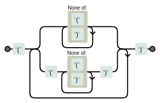
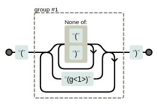

# <a name="regular-expressions"></a>Regular Expressions

**Table of Contents**

* [Why is it needed?](#why-is-it-needed)
* [Syntax and operators](#syntax-and-operators)
* [Anchors](#anchors)
    * [Line anchors](#line-anchors)
    * [String anchors](#string-anchors)
    * [Word anchors](#word-anchors)
* [Alternation and Grouping](#alternation-and-grouping)
* [Escaping metacharacters](#escaping-metacharacters)
* [Dot metacharacter and Quantifiers](#dot-metacharacter-and-quantifiers)
    * [Greedy quantifiers](#greedy-quantifiers)
    * [Non-greedy quantifiers](#non-greedy-quantifiers)
    * [Possessive quantifiers](#possessive-quantifiers)
* [match, scan and globals](#match-scan-and-globals)
* [Character class](#character-class)
* [Groupings and backreferences](#groupings-and-backreferences)
    * [Non-capturing groups](#non-capturing-groups)
    * [Named capture groups](#named-capture-groups)
* [Lookarounds](#lookarounds)
    * [Negative lookarounds](#negative-lookarounds)
    * [Positive lookarounds](#positive-lookarounds)
    * [Variable length lookbehind](#variable-length-lookbehind)
* [Modifiers](#modifiers)
* [Unicode](#unicode)
* [Miscellaneous](#miscellaneous)
    * [Using hashes](#using-hashes)
    * [\G anchor](#g-anchor)
    * [Recursive matching](#recursive-matching)
    * [Substitution in conditional expression](#substitution-in-conditional-expression)
* [Gotchas](#gotchas)
* [Further Reading](#further-reading)

<br>

* Examples in this chapter will deal with *ASCII* characters only unless otherwise specified
* Some features are not documented on [ruby-doc: Regexp](https://ruby-doc.org/core-2.5.0/Regexp.html), see [Onigmo regular expressions library](https://github.com/k-takata/Onigmo/blob/master/doc/RE) for such cases

<br>

## <a name="why-is-it-needed"></a>Why is it needed?

* useful for text processing defined by *regular* structure, for ex:
    * replace something only at start/end of string
    * extract portions defined by set of characters - for ex: words, integers, floats, hex, etc
    * replace something only if it matches a surrounding condition
    * validate string format
* modern regular expressions implemented in high level languages support non-regular features like recursion too, so usage of the term is different than the mathematical concept

**Further Reading**

* [softwareengineering.stackexchange: Is it a must for every programmer to learn regular expressions?](https://softwareengineering.stackexchange.com/questions/133968/is-it-a-must-for-every-programmer-to-learn-regular-expressions)
* [softwareengineering.stackexchange: When you should NOT use Regular Expressions?](https://softwareengineering.stackexchange.com/questions/113237/when-you-should-not-use-regular-expressions)
* [wikipedia: Regular expression](https://en.wikipedia.org/wiki/Regular_expression) for discussion as a formal language as well as various implementations

<br>

## <a name="syntax-and-operators"></a>Syntax and operators

Quoting from [ruby-doc: Regexp](https://ruby-doc.org/core-2.5.0/Regexp.html)

>Regular expressions (*regexps*) are patterns which describe the contents of a string. They're used for testing whether a string contains a given pattern, or extracting the portions that match. They are created with the `/pat/` and `%r{pat}` literals or the `Regexp.new` constructor.

* for now, let's see normal string matching using regexp without introducing regexp features

```ruby
>> sentence = 'This is a sample string'
=> "This is a sample string"

# check if string argument is present or not
>> sentence.include?('is')
=> true
>> sentence.include?('z')
=> false

# check if pattern specified by regexp argument is present or not
>> sentence.match?(/is/)
=> true
>> sentence.match?(/z/)
=> false

# a 2nd argument can be given to specify starting index
>> sentence.match?(/is/, 6)
=> false
```

* regexp literals can be saved in a variable
* like double quoted string, it allows interpolation and escape sequences like `\t`, `\n`, `\x27`, etc

```ruby
>> r = /is/
=> /is/
>> 'this'.match?(r)
=> true
>> 'hello'.match?(r)
=> false

>> ip = gets.chomp
hi
=> "hi"
>> r = /t#{ip}s/
=> /this/
>> 'thistle'.match?(r)
=> true

>> r = /t#{ip.upcase}s/
=> /tHIs/
>> r = /t#{2*3}s/
=> /t6s/
```

* the `=~` match operator returns index of first match or `nil` if no match is found
* the `!~` match operator returns `true` if string doesn't contain the given regexp, `false` otherwise
* both `=~` and `!~` can be used in conditional statement instead of `match?` method
* a key difference from `match?` is that these operators will also set some global variables (will be covered later)

```ruby
>> sentence = 'This is a sample string'
=> "This is a sample string"

# can also use: /is/ =~ sentence
>> sentence =~ /is/
=> 2
>> sentence =~ /z/
=> nil

>> puts 'hi' if sentence =~ /is/
hi
=> nil
>> puts 'hi' if sentence =~ /z/
=> nil

# can also use: /z/ !~ sentence
>> sentence !~ /z/
=> true
>> sentence !~ /is/
=> false
```

* the `===` operator returns `true` or `false` similar to `match?` method, but in addition this will set global variables
* this is more useful when using Enumerable methods like `grep/grep_v/all?/any?/etc` as they use the `===` operator

```ruby
>> sentence = 'This is a sample string'
=> "This is a sample string"

>> /is/ === sentence
=> true
>> /z/ === sentence
=> false

>> words = %w[cat parrot whale]
=> ["cat", "parrot", "whale"]
>> words.all?(/a/)
=> true
>> words.all?(/t/)
=> false
```

<br>

## <a name="anchors"></a>Anchors

* Often, search must match from beginning of line or towards end of line
    * for ex: a method definition at start of line and method arguments at end of line
* We'll see built-in regexp boundary features in this section
    * later sections will cover how to create your own custom boundary

<br>

#### <a name="line-anchors"></a>Line anchors

* a string input may contain single or multiple lines
    * line is distinguished from another by a newline character
* the `^` metacharacter anchors the regexp pattern to start of line
* the `$` metacharacter anchors the regexp pattern to end of line
* in later sections we'll see how to match `^` and `$` characters literally

```ruby
>> s = 'cat and dog'
=> "cat and dog"

# without anchors, matching happens anywhere in the string
>> s.match?(/cat/)
=> true
>> s.match?(/dog/)
=> true

# match only at start of line
>> s.match?(/^cat/)
=> true
>> s.match?(/^dog/)
=> false

# match only at end of line
>> s.match?(/dog$/)
=> true

# match complete line
>> s.match?(/^dog$/)
=> false
```

* multiline examples

```ruby
>> "hi hello\ntop spot".match?(/^top/)
=> true
>> "hi hello\ntop spot".match?(/^hello/)
=> false

>> "spare\npar\ndare".match?(/^par$/)
=> true
>> "spare\npar\ndare".match?(/^are$/)
=> false
```

* the `sub` and `gsub` methods allow to use regexp as well

```ruby
>> s = 'catapults concatenate cat scat'
=> "catapults concatenate cat scat"

>> s.gsub('cat', 'XYZ')
=> "XYZapults conXYZenate XYZ sXYZ"
>> s.gsub(/cat/, 'XYZ')
=> "XYZapults conXYZenate XYZ sXYZ"

>> s.gsub(/^cat/, 'XYZ')
=> "XYZapults concatenate cat scat"
>> s.gsub(/cat$/, 'XYZ')
=> "catapults concatenate cat sXYZ"

>> "catapults\nconcatenate\ncat\nscat\n".gsub(/^cat/, 'XYZ')
=> "XYZapults\nconcatenate\nXYZ\nscat\n"
>> "catapults\nconcatenate\ncat\nscat\n".gsub(/cat$/, 'XYZ')
=> "catapults\nconcatenate\nXYZ\nsXYZ\n"
```

* adding something to start/end of line

```ruby
>> s = "catapults\nconcatenate\ncat"
=> "catapults\nconcatenate\ncat"
>> puts s.gsub(/^/, '1: ')
1: catapults
1: concatenate
1: cat

# if replacement/block is not given, gsub returns an Enumerator
>> puts s.gsub(/^/).with_index(1) { |m, i| "#{i}: " }
1: catapults
2: concatenate
3: cat

>> puts s.gsub(/$/, '.')
catapults.
concatenate.
cat.
```

* if there is a newline character at end of string, there is an additional end of line match but no additional start of line match

```ruby
>> puts "a\nb\n".gsub(/^/, 'foo ')
foo a
foo b
>> puts "a\n\n".gsub(/^/, 'foo ')
foo a
foo 

>> puts "a\nb\n".gsub(/$/, ' baz')
a baz
b baz
 baz
>> puts "a\n\n".gsub(/$/, ' baz')
a baz
 baz
 baz
```

<br>

#### <a name="string-anchors"></a>String anchors

* similar to line anchors, but for whole input string instead of individual lines
* `\A` will match start of string

```ruby
>> "hi hello\ntop spot".match?(/^top/)
=> true
>> "hi hello\ntop spot".match?(/\Atop/)
=> false

>> "hi hello\ntop spot".match?(/^hi/)
=> true
>> "hi hello\ntop spot".match?(/\Ahi/)
=> true
```

* `\z` will match end of string

```ruby
>> "spare\npar\ndare".gsub(/are$/, 'ABC')
=> "spABC\npar\ndABC"

>> "spare\npar\ndare".gsub(/are\z/, 'ABC')
=> "spare\npar\ndABC"
# can also use sub as there can be only one end of string
>> "spare\npar\ndare".sub(/are\z/, 'ABC')
=> "spare\npar\ndABC"
```

* `\Z` will also match end of string
* but if newline is last character, then it matches just before newline character

```ruby
# same result for both \z and \Z
>> "spare\npar\ndare".sub(/are\z/, 'ABC')
=> "spare\npar\ndABC"
>> "spare\npar\ndare".sub(/are\Z/, 'ABC')
=> "spare\npar\ndABC"

# different results as there is a \n at end
>> "spare\npar\ndare\n".sub(/are\z/, 'ABC')
=> "spare\npar\ndare\n"
>> "spare\npar\ndare\n".sub(/are\Z/, 'ABC')
=> "spare\npar\ndABC\n"
```

<br>

#### <a name="word-anchors"></a>Word anchors

* **word** character is any alphabet (irrespective of case), digit and the underscore character
* word anchors help in matching or not matching boundaries of a word
    * for example, to distinguish between `par`, `spar` and `apparent`
* `\b` matches word boundary
    * unlike line/string anchors, `\b` matches both start/end of word

```ruby
>> s = 'par spar apparent spare part'
=> "par spar apparent spare part"

# replace 'par' irrespective of where it occurs
>> s.gsub(/par/, 'X')
=> "X sX apXent sXe Xt"
# replace 'par' only at start of word
>> s.gsub(/\bpar/, 'X')
=> "X spar apparent spare Xt"
# replace 'par' only at end of word
>> s.gsub(/par\b/, 'X')
=> "X sX apparent spare part"
# replace 'par' only if it is not part of another word
>> s.gsub(/\bpar\b/, 'X')
=> "X spar apparent spare part"

# add something at word boundaries
>> s.gsub(/\b/, ':')
=> ":par: :spar: :apparent: :spare: :part:"
>> puts s.gsub(/\b/, "'").gsub(/ /, ',')
'par','spar','apparent','spare','part'
>> puts 'foo_12a:_:3b'.gsub(/\b/, "'")
'foo_12a':'_':'3b'
```

* `\B` is opposite of `\b`, it matches non-word boundaries

```ruby
>> s = 'par spar apparent spare part'
=> "par spar apparent spare part"

# replace 'par' if it is not start of word
>> s.gsub(/\Bpar/, 'X')
=> "par sX apXent sXe part"
# replace 'par' at end of word but not whole word 'par'
>> s.gsub(/\Bpar\b/, 'X')
=> "par sX apparent spare part"
# replace 'par' if it is not end of word
>> s.gsub(/par\B/, 'X')
=> "par spar apXent sXe Xt"
# replace 'par' if it is surrounded by word characters
>> s.gsub(/\Bpar\B/, 'X')
=> "par spar apXent sXe part"

# add something at non-word boundaries
>> puts 'foo_1 3b'.gsub(/\B/, ':')
f:o:o:_:1 3:b
```

<br>

## <a name="alternation-and-grouping"></a>Alternation and Grouping

* multiple regexps can be combined using `|` metacharacter to match either of them
* regexp on either side of `|` can have their own independent anchors

```ruby
>> 'I like cats'.match?(/cat|dog/)
=> true
>> 'I like dogs'.match?(/cat|dog/)
=> true
>> 'I like parrots'.match?(/cat|dog/)
=> false

>> 'catapults concatenate cat scat'.gsub(/^cat|cat\b/, 'X')
=> "Xapults concatenate X sX"
>> 'cat dog bee parrot fox'.gsub(/cat|dog|fox/, 'mammal')
=> "mammal mammal bee parrot mammal"
```

* beware of corner cases - the regexp that matches earliest in the string wins

```ruby
>> s = 'cat dog bee parrot fox'
=> "cat dog bee parrot fox"
>> s.index('cat')
=> 0
>> s.index('dog')
=> 4
# index of 'cat' < index of 'dog'
# so 'cat' will be replaced irrespective of order of regexp
>> s.sub(/cat|dog/, 'mammal')
=> "mammal dog bee parrot fox"
>> s.sub(/dog|cat/, 'mammal')
=> "mammal dog bee parrot fox"

# if the result is confusing, unroll gsub loop to two sub
# and calculate index for both regexp before each sub
>> 'far fear'.gsub(/ar|ear/, 'Y')
=> "fY fY"
>> 'far fear'.gsub(/ear|ar/, 'Y')
=> "fY fY"
```

* if index is same, then precedence is left to right
* a simple workaround to remember as a trick is to sort the alternations longest first
* See also [regular-expressions: alternation](https://www.regular-expressions.info/alternation.html)

```ruby
>> s = 'handful'
=> "handful"
>> s.index('hand')
=> 0
>> s.index('handful')
=> 0
>> s.sub(/hand|handful/, 'X')
=> "Xful"
>> s.sub(/handful|hand/, 'X')
=> "X"

# if the result is confusing, unroll gsub loop to multiple sub
# and calculate index for all three regexps before each sub
>> 'hand handy handful'.gsub(/hand|handy|handful/, 'X')
=> "X Xy Xful"
>> 'hand handy handful'.gsub(/handy|hand|handful/, 'X')
=> "X X Xful"
>> 'hand handy handful'.gsub(/handy|handful|hand/, 'X')
=> "X X X"
```

* common portion can be grouped inside `()` metacharacters
* Similar to `a(b+c) = ab + ac` in maths, `a(b|c) = ab|ac` in regexp

```ruby
>> 'red reform read rest'.gsub(/reform|rest/, 'X')
=> "red X read X"
>> 'red reform read rest'.gsub(/re(form|st)/, 'X')
=> "red X read X"

>> 'par spare part party'.gsub(/\bpar\b|\bpart\b/, 'X')
=> "X spare X party"
>> 'par spare part party'.gsub(/\b(par|part)\b/, 'X')
=> "X spare X party"
>> 'par spare part party'.gsub(/\bpar(|t)\b/, 'X')
=> "X spare X party"
```

* use `Regexp.union` method to build alternation from a list of arguments
    * if argument is not a regexp, the method will try to convert it to regexp first

```ruby
>> Regexp.union('par', 'part')
=> /par|part/

>> words = %w[cat dog fox]
=> ["cat", "dog", "fox"]
>> 'cat dog bee parrot fox'.gsub(Regexp.union(words), 'mammal')
=> "mammal mammal bee parrot mammal"

# sort the list as longest string first where needed
>> words = %w[hand handy handful hands handed]
=> ["hand", "handy", "handful", "hands", "handed"]
>> Regexp.union(words.sort_by { |w| -w.length })
=> /handful|handed|handy|hands|hand/
```

<br>

## <a name="escaping-metacharacters"></a>Escaping metacharacters

* we have seen metacharacters like `^`, `$`, `\`, `|`, `(`, etc so far
* to match them literally, escape them by prefixing `\` character

```ruby
# even though ^ is not being used as anchor, it won't be matched literally
>> 'cost^2 + a^5'.sub(/cost^2/) { |s| s.upcase }
=> "cost^2 + a^5"
# escaping will work
>> 'cost^2 + a^5'.sub(/cost\^2/) { |s| s.upcase }
=> "COST^2 + a^5"

>> 'pa$$ed'.gsub(/\$/, 's')
=> "passed"

>> '(a*b) + c'.gsub(/\(|\)/, '')
=> "a*b + c"

>> 'a || b'.gsub(/\|/, '&')
=> "a && b"

>> '\foo\bar\baz'.gsub(/\\/, '/')
=> "/foo/bar/baz"
```

* use `Regexp.escape` to let Ruby handle escaping all the metacharacters present in a string
    * `Regexp.union` also escapes the metacharacters present in string arguments
* to avoid escaping altogether, use string argument instead of regexp when regexp features are not needed

```ruby
>> puts Regexp.escape('(a^b)')
\(a\^b\)
>> Regexp.union('foo', '(a^b)')
=> /foo|\(a\^b\)/

>> eqn = 'f*(a^b) - 3*(a^b)'
=> "f*(a^b) - 3*(a^b)"
>> s = '(a^b)'
=> "(a^b)"

>> eqn.gsub(s, 'c')
=> "f*c - 3*c"

# use Regexp.escape if additional regexp features are needed
>> eqn.gsub(/#{s}$/, 'c')
=> "f*(a^b) - 3*(a^b)"
>> eqn.gsub(/#{Regexp.escape(s)}$/, 'c')
=> "f*(a^b) - 3*c"
```

* use `%r` percent string to use any other delimiter than the default `/`

```ruby
>> '/foo/bar/baz/123'.match?('o/bar/baz/1')
=> true

>> '/foo/bar/baz/123' =~ /o\/bar\/baz\/1/
=> 3
>> '/foo/bar/baz/123' =~ %r{o/bar/baz/1}
=> 3

>> '/foo/bar/baz/123'.sub(/o\/bar\/baz\/1/, '/c/4')
=> "/fo/c/423"
>> '/foo/bar/baz/123'.sub(%r(o/bar/baz/1), '/c/4')
=> "/fo/c/423"
```

<br>

## <a name="dot-metacharacter-and-quantifiers"></a>Dot metacharacter and Quantifiers

* the `.` metacharacter matches any character except newline character
    * later on, we'll see how to match newline as well

```ruby
>> 'tac tin cat abc;tuv acute'.gsub(/c.t/, 'X')
=> "taXin X abXuv aXe"

>> 'breadth markedly reported overrides'.gsub(/r..d/) { |s| s.upcase }
=> "bREADth maRKEDly repoRTED oveRRIDes"

>> "42\t33".sub(/2.3/, '8')
=> "483"
```

<br>

#### <a name="greedy-quantifiers"></a>Greedy quantifiers

* quantifiers help to specify how many times to match a character or grouping
* the `?` quantifier will match `0` or `1` times

```ruby
# same as: /far|fear/
>> 'far feat flare fear'.gsub(/fe?ar/, 'X')
=> "X feat flare X"
# same as: /ear|ar/
>> 'far feat flare fear'.gsub(/e?ar/, 'X')
=> "fX feat flXe fX"

# same as: /\bpar(t|)\b/
>> 'par spare part party'.gsub(/\bpart?\b/, 'X')
=> "X spare X party"

# same as: /\b(re.d|red)\b/
>> 'red read ready re;d redo reed'.gsub(/\bre.?d\b/, 'X')
=> "X X ready X redo X"

# same as: /part|parrot/
>> 'par part parrot parent'.gsub(/par(ro)?t/, 'X')
=> "par X X parent"
# same as: /part|parrot|parent/
>> 'par part parrot parent'.gsub(/par(en|ro)?t/, 'X')
=> "par X X X"
```

* the `*` quantifier will match `0` or more times

```ruby
>> 'tr tear tare steer sitaara'.gsub(/ta*r/, 'X')
=> "X tear Xe steer siXa"
>> 'tr tear tare steer sitaara'.gsub(/t(e|a)*r/, 'X')
=> "X X Xe sX siXa"

>> '3111111111125111142'.gsub(/1*2/, 'X')
=> "3X511114X"
>> '3111111111125111142'.partition(/1*2/)
=> ["3", "11111111112", "5111142"]
>> '3111111111125111142'.rpartition(/1*2/)
=> ["311111111112511114", "2", ""]

>> '3111111111125111142'.split(/1*/)
=> ["3", "2", "5", "4", "2"]
>> '3111111111125111142'.split(/1*/, -1)
=> ["3", "2", "5", "4", "2", ""]
```

* the `+` quantifier will match `1` or more times

```ruby
>> 'tr tear tare steer sitaara'.gsub(/ta+r/, 'X')
=> "tr tear Xe steer siXa"
>> 'tr tear tare steer sitaara'.gsub(/t(e|a)+r/, 'X')
=> "tr X Xe sX siXa"

>> '3111111111125111142'.gsub(/1+2/, 'X')
=> "3X5111142"
>> '3111111111125111142'.split(/1+/)
=> ["3", "25", "42"]
```

* the `{}` quantifier forms allow using numbers
    * `{m, n}` will match `m` to `n` times
    * `{m,}` will match at least `m` times
    * `{,n}` will match up to `n` times (including `0` times)
    * `{n}` will match exactly `n` times

```ruby
>> s = 'abc ac adc abbc bbb bc abbbbbc'
=> "abc ac adc abbc bbb bc abbbbbc"

>> s.gsub(/ab{1,4}c/, 'X')
=> "X ac adc X bbb bc abbbbbc"

>> s.gsub(/ab{2,}c/, 'X')
=> "abc ac adc X bbb bc X"

>> s.gsub(/ab{,3}c/, 'X')
=> "X X adc X bbb bc abbbbbc"

>> s.gsub(/ab{2}c/, 'X')
=> "abc ac adc X bbb bc abbbbbc"
```

* the quantifiers we've seen so far are all greedy in nature
* other than `{n}`, rest of them can match varying quantities of preceding character or group
* so, in cases where there can be multiple ways to satisfy the regexp, the longest match would win
    * See also [ruby-doc: Regexp Performance](https://ruby-doc.org/core-2.5.0/Regexp.html#class-Regexp-label-Performance)

```ruby
>> s = 'that is quite a fabricated tale'
=> "that is quite a fabricated tale"

# .* means any character any number of times
# /t.*a/ would match from first 't' to last 'a' in the line
>> s.sub(/t.*a/, 'X')
=> "Xle"
>> 'star'.sub(/t.*a/, 'X')
=> "sXr"

>> s.sub(/f.*t/, 'X')
=> "that is quite a Xale"

# overall regexp has to match
# matching first 't' to last 'a' for t.*a won't work for these cases
# so, the regexp engine backtracks until .*q matches and so on
>> s.sub(/t.*a.*q.*f/, 'X')
=> "Xabricated tale"
>> s.sub(/t.*a.*u/, 'X')
=> "Xite a fabricated tale"
```

* longest match wins nature of greedy quantifier is preferable over equivalent regexp defined using alternation 

```ruby
# same as: /handy|handful|hand/
>> 'hand handy handful'.gsub(/hand(y|ful)?/, 'X')
=> "X X X"

# same as: /ear|ar/
>> 'far fear'.gsub(/e?ar/, 'Y')
=> "fY fY"

>> puts 'blah \< foo < bar \< blah < baz'
blah \< foo < bar \< blah < baz
# same as: /\\<|</
>> puts 'blah \< foo < bar \< blah < baz'.gsub(/\\?</, '\<')
blah \< foo \< bar \< blah \< baz
```

<br>

#### <a name="non-greedy-quantifiers"></a>Non-greedy quantifiers

* appending a `?` to greedy quantifiers will change matching from greedy to non-greedy i.e match as minimally as possible
    * also known as lazy quantifier

```ruby
>> s = 'that is quite a fabricated tale'
=> "that is quite a fabricated tale"

>> s.sub(/t.*?a/, 'X')
=> "Xt is quite a fabricated tale"
>> s.sub(/f.*?t/, 'X')
=> "that is quite a Xed tale"

# overall regexp has to match
>> s.sub(/t.*?te/, 'X')
=> "X a fabricated tale"
# greedy version
>> s.sub(/t.*te/, 'X')
=> "Xd tale"

>> '123456789'.sub(/.{2,5}?/, '')
=> "3456789"
>> '123456789'.sub(/.{2,5}/, '')
=> "6789"
```

<br>

#### <a name="possessive-quantifiers"></a>Possessive quantifiers

* appending a `+` to greedy quantifiers will change matching from greedy to possessive matching
* it is like greedy matching but without backtracking
    * if both greedy and possessive nature yields same results, possessive would be faster
    * if results are different, usage depends on which one is required
* See also [stackoverflow: Greedy vs Reluctant vs Possessive Quantifiers](https://stackoverflow.com/questions/5319840/greedy-vs-reluctant-vs-possessive-quantifiers)

```ruby
# same results, possessive would be faster
>> 'abc ac adc abbbc'.gsub(/ab*c/, 'X')
=> "X X adc X"
>> 'abc ac adc abbbc'.gsub(/ab*+c/, 'X')
=> "X X adc X"

# different results
>> 'feat ft feaeat'.gsub(/f(a|e)*at/, 'X')
=> "X ft X"
# (a|e)*+ would match 'a' or 'e' as much as possible
# no backtracking, so another 'a' can never match
>> 'feat ft feaeat'.gsub(/f(a|e)*+at/, 'X')
=> "feat ft feaeat"
```

<br>

## <a name="match-scan-and-globals"></a>match, scan and globals

* similar to `match?`, the `match` method accepts a regexp and optional starting index
    * both these methods treat string argument as a regexp, unlike sub/split/etc
* the return value is of type `MatchData` from which various information can be extracted
    * See [ruby-doc: MatchData](https://ruby-doc.org/core-2.5.0/MatchData.html) for details

```ruby
>> 'abc ac adc abbbc'.match(/ab*c/)
=> #<MatchData "abc">
>> 'abc ac adc abbbc'.match(/ab*c/)[0]
=> "abc"

# string argument is treated same as a regexp
>> 'abc ac adc abbbc'.match('ab*c', 1)
=> #<MatchData "ac">
>> 'abc ac adc abbbc'.match('ab*c', 1)[0]
=> "ac"

>> 'abc ac adc abbbc'.match(/ab*c/, 7)
=> #<MatchData "abbbc">
>> 'abc ac adc abbbc'.match(/ab*c/, 7)[0]
=> "abbbc"
```

* another way to get matched string is providing regexp within `[]` on a string value

```ruby
>> s = 'abc ac adc abbbc'
=> "abc ac adc abbbc"

>> s[/ab*c/]
=> "abc"
>> s[1..-1][/ab*c/]
=> "ac"

>> s[/ab{2,}c/]
=> "abbbc"
```

* `scan` method returns all the matched strings as an array

```ruby
>> 'abc ac adc abbbc'.scan(/ab*c/)
=> ["abc", "ac", "abbbc"]
>> 'abc ac adc abbbc'.scan(/ab+c/)
=> ["abc", "abbbc"]
>> 'par spar apparent spare part'.scan(/\bs?pare?\b/)
=> ["par", "spar", "spare"]

# greedy vs non-greedy
>> 'that is quite a fabricated tale'.scan(/t.*a/)
=> ["that is quite a fabricated ta"]
>> 'that is quite a fabricated tale'.scan(/t.*?a/)
=> ["tha", "t is quite a", "ted ta"]

# use block to iterate over matched strings
>> 'abc ac adc abbbc'.scan(/ab+c/) { |s| puts s.upcase }
ABC
ABBBC
```

* global variables hold information related to matched data
    * as noted before, `match?` method won't affect these variables
* `$~` contains `MatchData`
* <code>$`</code> contains string before the matched string
* `$&` contains matched string
* `$'` contains string after the matched string

```ruby
>> s = 'that is quite a fabricated tale'
=> "that is quite a fabricated tale"
>> s =~ /q.*b/
=> 8

>> $~
=> #<MatchData "quite a fab">
>> $~[0]
=> "quite a fab"
>> $`
=> "that is "
>> $&
=> "quite a fab"
>> $'
=> "ricated tale"
```

* for multiple matches, global variables will update for every match

```ruby
# same as: { |s| puts s.upcase }
>> 'abc ac adc abbbc'.scan(/ab+c/) { puts $&.upcase }
ABC
ABBBC

# referring to them after the instruction will have info only for last match
>> 'par spar apparent spare part'.scan(/\bpar\b|\bspare\b/)
=> ["par", "spare"]
>> $~
=> #<MatchData "spare">
>> $`
=> "par spar apparent "
>> $&
=> "spare"
>> $'
=> " part"
```

* `$1` will have string matched by first group
* `$2` will have string matched by second group and so on
* `$+` will have string matched by last group
* default value is `nil` if the group number didn't have a match

```ruby
>> s = 'that is quite a fabricated tale'
=> "that is quite a fabricated tale"

>> s =~ /(th.*q).*(b.*c)/
=> 0
>> $1
=> "that is q"
>> $2
=> "bric"
>> $+
=> "bric"

>> s =~ /s.*(q.*(f.*b).*c).*d/
=> 6
>> $&
=> "s quite a fabricated"
>> $1
=> "quite a fabric"
>> $2
=> "fab"
```

* group data can also be retrieved from MatchData
* negative index can be used, makes it easier to get last match, second last, etc

```ruby
>> s = 'that is quite a fabricated tale'
=> "that is quite a fabricated tale"
>> s =~ /(q.*(f.*b).*c).*d/
=> 8

>> $~
=> #<MatchData "quite a fabricated" 1:"quite a fabric" 2:"fab">
>> $~.to_a
=> ["quite a fabricated", "quite a fabric", "fab"]
>> $~[-2]
=> "quite a fabric"

>> s[/(q.*(f.*b).*c).*d/]
=> "quite a fabricated"
>> s[/(q.*(f.*b).*c).*d/, 0]
=> "quite a fabricated"
>> s[/(q.*(f.*b).*c).*d/, 1]
=> "quite a fabric"
>> s[/(q.*(f.*b).*c).*d/, 2]
=> "fab"
```

<br>

## <a name="character-class"></a>Character class

* `.` meta character provides a way to match any character
* character class provides a way to match any character among a specified set of characters enclosed within `[]`
* quantifiers can be applied to characters class as well

```ruby
# same as: /c(o|u)t/
>> 'cut cat cot coat'.gsub(/c[ou]t/, 'X')
=> "X cat X coat"

# same as: /(a|o)+t/
>> 'oat ft boa foot'.gsub(/[ao]+t/, 'X')
=> "X ft boa fX"

>> 'foo5932baz'.sub(/[0123456789]+/, '')
=> "foobaz"
```

* matching any alphabet, number, hexadecimal number etc becomes cumbersome if every character has to be individually specified
* so, there's a shortcut, using `-` to construct a range

```ruby
>> 'foo5932baz'.sub(/[0-9]+/, '')
=> "foobaz"

# whole words made up of lowercase alphabets only
>> 'coat Bin food tar12 best'.scan(/\b[a-z]+\b/)
=> ["coat", "food", "best"]

# whole words made up of lowercase alphabets and digits only
>> 'coat Bin food tar12 best'.scan(/\b[a-z0-9]+\b/)
=> ["coat", "food", "tar12", "best"]

# whole words made up of lowercase alphabets, starting with p to z
>> 'coat tin food put stoop best'.scan(/\b[p-z][a-z]+\b/)
=> ["tin", "put", "stoop"]

# whole words made up of a to f, p to t lowercase alphabets
>> 'coat tin food put stoop best'.scan(/\b[a-fp-t]+\b/)
=> ["best"]
```

* some simple cases of numeric range can be constructed using character class
    * use block form for the rest
* See also [regular-expressions: matching numeric ranges](https://www.regular-expressions.info/numericranges.html)

```ruby
# numbers between 10 to 29
>> '23 154 12 26 98234'.scan(/\b[12][0-9]\b/)
=> ["23", "12", "26"]

# numbers >= 100
>> '23 154 12 26 98234'.scan(/\b[0-9]{3,}\b/)
=> ["154", "98234"]

# numbers >= 100 if there are leading zeros
>> '0501 035 154 12 26 98234'.scan(/\b0*[1-9][0-9]{2,}\b/)
=> ["0501", "154", "98234"]

>> '45 349 651 593 4 204'.gsub(/[0-9]+/) { $&.to_i < 350 ? 0 : 1 }
=> "0 0 1 1 0 0"
```

* character class has its own set of metacharacters
* we've already seen `-` which helps to form a range
* using `^` as first character inside `[]` will result in matching characters other than those specified

```ruby
# deleting characters from start of line based on a delimiter
>> 'foo=42; baz=123'.sub(/^[^=]+/, '')
=> "=42; baz=123"
>> 'foo=42; baz=123'.sub(/^[^=]+=/, '')
=> "42; baz=123"
# remove first two columns where : is delimiter
>> 'foo:123:bar:baz'.sub(/^([^:]+:){2}/, '')
=> "bar:baz"

# deleting characters at end of line based on a delimiter
>> 'foo=42; baz=123'.sub(/=[^=]+$/, '')
=> "foo=42; baz"

# filtering words without vowels
>> words = %w[tryst glyph pity why]
=> ["tryst", "glyph", "pity", "why"]
# can also use: words.grep_v(/[aeiou]/)
>> words.grep(/\A[^aeiou]+\z/)
=> ["tryst", "glyph", "why"]
```

* use `&&` to define intersection of two or more character classes

```ruby
# [^aeiou] will match any non-vowel character
# which means space is also a valid character to be matched
>> 'tryst glyph pity why'.scan(/\b[^aeiou]+\b/)
=> ["tryst glyph ", " why"]

# [a-z&&[^aeiou]] will be intersection of a-z and non-vowel characters
# so, we get a positive definition of characters to match and avoids surprises
>> 'tryst glyph pity why'.scan(/\b[a-z&&[^aeiou]]+\b/)
=> ["tryst", "glyph", "why"]
```

* escaping character class metacharacters

```ruby
# - should be first or last character or escaped using \
>> 'ab-cd gh-c 12-423'.scan(/\b[a-z-]{2,}\b/)
=> ["ab-cd", "gh-c"]
>> 'ab-cd gh-c 12-423'.scan(/\b[a-z\-0-9]{2,}\b/)
=> ["ab-cd", "gh-c", "12-423"]

# ^ should be other than first character or escaped using \
>> 'f*(a^b) - 3*(a+b)'.scan(/a[+^]b/)
=> ["a^b", "a+b"]
>> 'f*(a^b) - 3*(a+b)'.scan(/a[\^+]b/)
=> ["a^b", "a+b"]

# [, ] and \ should be escaped using \
>> 'a[5]24 bcd'.match(/[\[0-9]+/)
=> #<MatchData "[5">
>> 'a[5]24 bcd'.match(/[\]0-9]+/)
=> #<MatchData "5]24">
>> puts '5ba\babc2'.match(/[a\\b]+/)
ba\bab
```

* commonly used character sets have predefined escape sequences
    * `\w` is equivalent to `[A-Za-z0-9_]` for matching word characters
    * `\d` is equivalent to `[0-9]` for matching digit characters
    * `\s` is equivalent to `[ \t\r\n\f\v]` for matching whitespace characters
    * `\h` is equivalent to `[0-9a-fA-F]` for matching hexadecimal characters
    * `\W`, `\D`, `\S` and `\H` respectively for their negated character class

```ruby
>> '128A foo1 fe32 34 bar'.scan(/\b\h+\b/)
=> ["128A", "fe32", "34"]
>> '128A foo1 fe32 34 bar'.scan(/\b\h+\b/).map(&:hex)
=> [4746, 65074, 52]

>> 'foo=5, bar=3; x=83, y=120'.scan(/\d+/).map(&:to_i)
=> [5, 3, 83, 120]
>> 'Sample123string54with908numbers'.split(/\d+/)
=> ["Sample", "string", "with", "numbers"]
>> 'like 42 and 37.'.gsub(/\D+/, 'X')
=> "X42X37X"

>> "foo:ab 12:baz_3:_:::par\tpool".scan(/\w+/)
=> ["foo", "ab", "12", "baz_3", "_", "par", "pool"]
>> "foo:ab 12:baz_3:_:::par\tpool".scan(/[\w\s]+/)
=> ["foo", "ab 12", "baz_3", "_", "par\tpool"]

>> "      a  \v\f  ate b\tc   \r\n123          ".split
=> ["a", "ate", "b", "c", "123"]
>> "      a  \v\f  ate b\tc   \r\n123          ".split(/\s+/, -1)
=> ["", "a", "ate", "b", "c", "123", ""]
```

* Ruby also provides named character sets, which are unicode aware unlike the escape sequences which only work on *ASCII* characters
    * a named character set is defined by a name enclosed between `[:` and `:]` and has to be used within a character class `[]`, along with any other character as needed
    * `[:^` instead of `[:` will negate the character set
* only some examples for *ASCII* input given below, see [ruby-doc: Character Classes](https://ruby-doc.org/core-2.5.0/Regexp.html#class-Regexp-label-Character+Classes) for more details and other named character sets

```ruby
# similar to: /\d+/ or /[0-9]+/
>> 'foo=5, bar=3; x=83, y=120'.scan(/[[:digit:]]+/)
=> ["5", "3", "83", "120"]
# similar to: /\D+/ or /[^0-9]+/
# can also use: /[[:^digit:]]+/
>> 'like 42 and 37.'.gsub(/[^[:digit:]]+/, 'X')
=> "X42X37X"

# similar to: /[\w\s]+/
>> "foo:ab 12:baz_3:_:::par\tpool".scan(/[[:word:][:space:]]+/)
=> ["foo", "ab 12", "baz_3", "_", "par\tpool"]

# similar to: /[a-zA-Z]+/
>> 'Sample123string54with908numbers'.scan(/[[:alpha:]]+/)
=> ["Sample", "string", "with", "numbers"]

# remove all punctuation characters
>> 'hi there! how are you?? all fine here.'.gsub(/[[:punct:]]+/, '')
=> "hi there how are you all fine here"
```

<br>

## <a name="groupings-and-backreferences"></a>Groupings and backreferences

* the regexp grouping within `()` we've seen so far are also referred to as **capture groups**
* the string value that is matched by such groups can be referred outside the regexp using global variables `$1`, `$2`, etc
* they can be referred within the regexp itself using backreferences as `\1`, `\2`, etc
    * `\1`, `\2` upto `\9` can be used in replacement sections of `sub/gsub` when block form is not needed
    * `\0` would refer to entire matched string, equivalent to `$&`
* *Note* that the matched string is referenced, not the regexp itself
    * for ex: if `([0-9][a-f])` matches `3b`, then backreferencing will be `3b` not any other valid match of the regular expression like `8f`, `0a` etc

```ruby
# remove quotes surrounding digits
>> puts '"52" apples and "31" mangoes'.gsub(/"(\d+)"/, '\1')
52 apples and 31 mangoes
# replace __ with _ and delete _ if it is alone
>> '_foo_ __123__ _baz_'.gsub(/(_)?_/, '\1')
=> "foo _123_ baz"

# add something around the matched strings
>> '52 apples and 31 mangoes'.gsub(/\d+/, '(\0)')
=> "(52) apples and (31) mangoes"
>> 'Hello world'.sub(/.*/, 'Hi. \0. Have a nice day')
=> "Hi. Hello world. Have a nice day"

# swap words separated by a comma
>> 'a,b 42,64'.gsub(/(\w+),(\w+)/, '\2,\1')
=> "b,a 64,42"

# replace words having a consecutive repeated character
>> 'eel flee all pat ilk seen'.gsub(/\b\w*(\w)\1\w*\b/, 'X')
=> "X X X pat ilk X"
# remove any number of consecutive duplicate words separated by space
>> 'a a a walking for for a cause'.gsub(/\b(\w+)( \1)+\b/, '\1')
=> "a walking for a cause"
```

* using capture groups affects behavior of string methods like `scan` and `split`

```ruby
# without capture group
>> 'Sample123string54with908numbers'.split(/\d+/)
=> ["Sample", "string", "with", "numbers"]
# to include the matching delimiter strings as well in the output
>> 'Sample123string54with908numbers'.split(/(\d+)/)
=> ["Sample", "123", "string", "54", "with", "908", "numbers"]

# only the string matched within groups will be in output
>> '_foo_ cat _123_ _baz_ dog'.scan(/_(\w+)_/)
=> [["foo"], ["123"], ["baz"]]
# each element is an array containing all the groups
>> 'a:b 42:64'.scan(/(\w+):(\w+)/)
=> [["a", "b"], ["42", "64"]]
>> 'a:b c: 42:64'.scan(/(\w+):(\w*)/)
=> [["a", "b"], ["c", ""], ["42", "64"]]
```

* `\1`, `\2` etc backreferences the matched string
* use `\g<1>`, `\g<2>` etc to backreference the regular expression itself

```ruby
>> s = 'cat,2008-03-24,foo,2012-08-12,5632'
=> "cat,2008-03-24,foo,2012-08-12,5632"

>> s.match(/(\d{4}-\d{2}-\d{2}).*\g<1>/)[0]
=> "2008-03-24,foo,2012-08-12"
```

<br>

#### <a name="non-capturing-groups"></a>Non-capturing groups

* use `(?:)` instead of `()` to group regexps without capturing it
* such groups won't be counted for backreference/global variables

```ruby
# normal capture group will hinder ability to get whole match
>> 'cost tin food put shin best'.scan(/\b\w*(st|in)\b/)
=> [["st"], ["in"], ["in"], ["st"]]
# non-capturing group to the rescue
>> 'cost tin food put shin best'.scan(/\b\w*(?:st|in)\b/)
=> ["cost", "tin", "shin", "best"]

# with normal grouping, need to keep track of all the groups
>> '1,2,3,4,5,6,7'.sub(/^(([^,]+,){3})([^,]+)/, '\1(\3)')
=> "1,2,3,(4),5,6,7"
# using non-capturing groups, only relevant groups have to be tracked
>> '1,2,3,4,5,6,7'.sub(/^((?:[^,]+,){3})([^,]+)/, '\1(\2)')
=> "1,2,3,(4),5,6,7"

>> 'foo:-:abc34baz25tar:-:par'.split(/(?:\d+|:-:)/)
=> ["foo", "abc", "baz", "tar", "par"]
```

* but if regexp itself needs backreference, capture group cannot be avoided
* in such cases, `gsub` comes in handy instead of `scan`
    * without a 2nd argument or block, `gsub` returns an Enumerator which can be used as needed

```ruby
# same as: scan(/\b\w*(?:st|in)\b/)
>> 'cost peel tin food put shin best'.gsub(/\b\w*(st|in)\b/).to_a
=> ["cost", "tin", "shin", "best"]

# same as: scan(/\b\w*(?:st|in)\b/).map(&:upcase)
>> 'cost peel tin food put shin best'.gsub(/\b\w*(st|in)\b/).map(&:upcase)
=> ["COST", "TIN", "SHIN", "BEST"]

# get all words containing consecutive repeated characters
>> 'cost peel tin food put shin best'.gsub(/\b\w*(\w)\1\w*\b/).to_a
=> ["peel", "food"]
>> 'eel flee all pat ilk seen'.gsub(/\b\w*(\w)\1\w*\b/).to_a
=> ["eel", "flee", "all", "seen"]
```

<br>

#### <a name="named-capture-groups"></a>Named capture groups

* capture groups can be given a name using `(?<name>)` or `(?'name')` and backreferenced using `\k<name>`
* both named capture groups and normal capture groups cannot be used at the same time

```ruby
# giving names to first and second captured words instead of default numbers
>> 'a,b 42,64'.gsub(/(?<fw>\w+),(?<sw>\w+)/, '\k<sw>,\k<fw>')
=> "b,a 64,42"
# alternate syntax
>> 'a,b 42,64'.gsub(/(?'fw'\w+),(?'sw'\w+)/, '\k<sw>,\k<fw>')
=> "b,a 64,42"

# named capture group can be used for backreferencing with \g as well
>> s.match(/(?<date>\d{4}-\d{2}-\d{2}).*\g<date>/)[0]
=> "2008-03-24,foo,2012-08-12"
```

* by using `regexp =~ string` instead of `string =~ regexp`, the named capture groups can be used as variable assignment inplace of `$1`, `$2`, etc
* See also [stackoverflow: named captures as a hash](https://stackoverflow.com/questions/18825669/how-to-do-named-capture-in-ruby)

```ruby
>> s = '2018-10-25,car'
=> "2018-10-25,car"

>> /(?<date>[^,]+),(?<product>[^,]+)/ =~ s
=> 0

# same as: $1
>> date
=> "2018-10-25"
# same as: $2
>> product
=> "car"
```

<br>

## <a name="lookarounds"></a>Lookarounds

* these provide a way to add assertions before and/or after the pattern of interest
* string matched by lookarounds won't be part of overall matched string, they specify a location similar to anchors
    * hence, these are also known as **zero-width patterns**

<br>

#### <a name="negative-lookarounds"></a>Negative lookarounds

* syntax is `(?<!)` for negative lookbehind and `(?!)` for negative lookahead
* these are also useful to specify custom boundaries

```ruby
# change 'foo' only if it is not preceded by _
# note how 'foo' at start of line is matched as well
>> 'foo _foo 1foo'.gsub(/(?<!_)foo/, 'baz')
=> "baz _foo 1baz"

# change word only if it is not preceded by : or --
>> ':cat --boat ;nice'.gsub(/(?<!:|--)\b\w+/, 'X')
=> ":cat --boat ;X"

# change 'foo' only if it is not followed by a digit character
>> 'foo _food 1foo32 foot5'.gsub(/foo(?!\d)/, 'baz')
=> "baz _bazd 1foo32 bazt5"

# words not surrounded by punctuation marks
>> ':cat top nice; cool. mad'.scan(/(?<![[:punct:]])\b\w+\b(?![[:punct:]])/)
=> ["top", "mad"]
```

<br>

#### <a name="positive-lookarounds"></a>Positive lookarounds

* syntax is `(?<=)` for positive lookbehind and `(?=)` for positive lookahead

```ruby
# extract digits only if it is followed by ,
>> '42 foo-5, baz3; x83, y-20; f12'.scan(/\d+(?=,)/)
=> ["5", "83"]
# extract digits only if it is preceded by - and followed by , or ;
>> '42 foo-5, baz3; x83, y-20; f12'.scan(/(?<=-)\d+(?=[;,])/)
=> ["5", "20"]

# except first and last fields
>> '1,2,3,4,5'.scan(/(?<=,)[^,]+(?=,)/)
=> ["2", "3", "4"]
>> '1,2,3,4,5'.gsub(/(?<=,)[^,]+(?=,)/, 'X')
=> "1,X,X,X,5"

# replace empty fields with NA
# same as: gsub(/(?<![^,])(?![^,])/, 'NA')
>> ',,1,,,2,,3,,'.gsub(/(?<=\A|,)(?=,|\z)/, 'NA')
=> "NA,NA,1,NA,NA,2,NA,3,NA,NA"
```

* even though lookarounds are not part of matched string, capture groups can be used inside them

```ruby
>> puts 'a b c d e'.gsub(/(\S+\s+)(?=(\S+)\s)/, "\\1\\2\n")
a b
b c
c d
d e

# use non-capturing group if needed
>> 'pore42 car3 pare7 care5'.scan(/(?<=(po|ca)re)\d+/)
=> [["po"], ["ca"]]
>> 'pore42 car3 pare7 care5'.scan(/(?<=(?:po|ca)re)\d+/)
=> ["42", "5"]
```

<br>

#### <a name="variable-length-lookbehind"></a>Variable length lookbehind

* string length of lookbehind assertion should be determinable statically
* `\K` and lookahead helps as a workaround for some of the variable-length lookbehind cases
    * Note that [\K is not documented](https://bugs.ruby-lang.org/issues/14500), so use only if you've tested it works for all cases
* See also [stackoverflow - Variable-length lookbehind-assertion alternatives](https://stackoverflow.com/questions/11640447/variable-length-lookbehind-assertion-alternatives-for-regular-expressions)

```ruby
# same as: gsub(/(?<=-)\d+/, 'X')
>> '42 foo-5, baz3; x83, y-20; f12'.gsub(/-\K\d+/, 'X')
=> "42 foo-X, baz3; x83, y-X; f12"

>> '1 land 2 sand 3 and 4 stand'.sub(/(?<=(and.*?){2})and/, 'X')
SyntaxError ((irb):2: invalid pattern in look-behind: /(?<=(and.*?){2})and/)
>> '1 land 2 sand 3 and 4 stand'.sub(/(and.*?){2}\Kand/, 'X')
=> "1 land 2 sand 3 X 4 stand"

>> 'foo and baz 123'.match?(/(?<!baz.*)123/)
SyntaxError ((irb):4: invalid pattern in look-behind: /(?<!baz.*)123/)
# match '123' in a string only if 'baz' doesn't occur before
# every character from start of string has to be consumed one by one
>> 'baz 123'.match?(/\A((?!baz).)*123/)
=> false
>> '123 foo'.match?(/\A((?!baz).)*123/)
=> true
>> 'foo and 123 baz'.match?(/\A((?!baz).)*123/)
=> true
```

* the absence operator `(?~)` provides a simpler syntax for some cases
* See [Onigmo regular expressions library](https://github.com/k-takata/Onigmo/blob/master/doc/RE) for details

```ruby
# match 'foo' followed by 'baz' only if '123' is not in between
# using negative lookahead
>> 'foo and 123 baz'.match?(/foo((?!123).)*baz/)
=> false
>> 'foo and 12 baz'.match?(/foo((?!123).)*baz/)
=> true

# using absence operator
# note that there is no quantifier
>> 'foo and 123 baz'.match?(/foo(?~123)baz/)
=> false
>> 'foo and 12 baz'.match?(/foo(?~123)baz/)
=> true
```

<br>

## <a name="modifiers"></a>Modifiers

* use `i` modifier to ignore case while matching

```ruby
>> 'Cat' =~ /cat/
=> nil
>> 'Cat' =~ /cat/i
=> 0

>> 'Cat scat CATER cAts'.gsub(/cat/i, 'X')
=> "X sX XER Xs"

# same as: scan(/[a-zA-Z]+/)
>> 'Sample123string54with908numbers'.scan(/[a-z]+/i)
=> ["Sample", "string", "with", "numbers"]
```

* use `m` modifier to allow `.` metacharacter to match newline character as well

```ruby
>> "tar foo 123\n42 baz car".sub(/foo.*baz/, 'X')
=> "tar foo 123\n42 baz car"

>> "tar foo 123\n42 baz car".sub(/foo.*baz/m, 'X')
=> "tar X car"

# multiple modifiers can be used as needed
>> "tar foo 123\n42 Baz car".sub(/foo.*baz/im, 'X')
=> "tar X car"
```

* use `o` modifier to perform interpolation only once
    * helpful if you are using regexp inside a loop and the expression inside the interpolation always gives same value
    * you could also save the regexp in a variable before the loop and use it instead of adding `o` modifier
* See also [Ruby regular expressions: the o modifier](https://robm.me.uk/ruby/2014/03/30/regex-o-modifier.html)

```ruby
>> n = 2
=> 2
>> words = %w[car bike bus auto train plane]
=> ["car", "bike", "bus", "auto", "train", "plane"]
# as 'o' modifier is used, expression inside #{} will be evaluated only once
>> words.grep(/\A\w{#{2**n}}\z/o)
=> ["bike", "auto"]

# expression result is not constant, so don't use 'o' modifier
>> words.select.with_index(1) { |w, i| w.match?(/\A\w{#{2**i}}\z/) }
=> ["bike"]
```

* `x` modifier allows to use literal whitespaces for aligning purposes and comments after the `#` character
* this way, a complex regexp can be broken into multiple lines with comments
* whitespace and `#` character needed as part of regexp should be escaped or use character class to represent them
* See [ruby-doc: Free-Spacing Mode and Comments](https://ruby-doc.org/core-2.5.0/Regexp.html#class-Regexp-label-Free-Spacing+Mode+and+Comments) for details

```ruby
# same as: r = /^((?:[^,]+,){3})([^,]+)/
>> r = /^(                  # group-1, captures first three columns
           (?:[^,]+,){3}    # non-capturing group to get the three columns
         )
        ([^,]+)             # group-2, captures fourth column
       /x

>> '1,2,3,4,5,6,7'.sub(r, '\1(\2)')
=> "1,2,3,(4),5,6,7"

>> 'cat and dog'.match?(/t a/x)
=> false
>> 'cat and dog'.match?(/t\ a/x)
=> true
>> 'cat and dog'.match?(/t\x20a/x)
=> true

>> 'foo a#b 123'.match(/a#b/x)
=> #<MatchData "a">
>> 'foo a#b 123'.match(/a\#b/x)
=> #<MatchData "a#b">
```

* a comment can also be added using `(?#comment)` when `x` modifier is not used
    * this is a non-capturing group

```ruby
>> r = /^((?:[^,]+,){3})(?#3-cols)([^,]+)(?#4th-col)/
=> /^((?:[^,]+,){3})(?#3-cols)([^,]+)(?#4th-col)/

>> '1,2,3,4,5,6,7'.sub(r, '\1(\2)')
=> "1,2,3,(4),5,6,7"
```

* regexp encoding can be changed from source encoding using modifiers
* for ex: `n` to specify regexp encoding as *ASCII-8BIT*
* See [ruby-doc: Regexp Encoding](https://ruby-doc.org/core-2.5.0/Regexp.html#class-Regexp-label-Encoding) for other such modifiers and details
* See also [ruby-doc: Encoding](https://ruby-doc.org/core-2.5.0/Encoding.html) for details on handling different string encodings

```ruby
>> s = 'foo - baz'
>> s.gsub(/\w+/n, '(\0)')
=> "(foo) - (baz)"

>> s = 'foo — baz'
>> s.gsub(/\w+/n, '(\0)')
(irb):4: warning: historical binary regexp match /.../n against UTF-8 string
=> "(foo) — (baz)"
```

* the modifiers can also be applied to specific portion of regexp instead of entire pattern, for ex:
    * `(?i:foo)` will apply case-insensitive matching only for this regexp portion
    * `(?-i:foo)` will avoid case-insensitive matching only for this regexp portion
    * `(?i)` will apply case-insensitive matching to regexp portion from this point onwards
* this way, modifiers for a regexp portion can be defined irrespective of modifier applied for entire regexp
* these are non-capturing groups

```ruby
# case-insensitive only for 'cat'
>> 'Cat scatter CATER cAts'.scan(/(?i:cat)[a-z]*\b/)
=> ["Cat", "catter", "cAts"]
>> 'Cat scatter CATER cAts'.scan(/cat(?-i)[a-z]*\b/i)
=> ["Cat", "catter", "cAts"]

# case-sensitive only for 'Cat'
>> 'Cat SCatTeR CATER cAts'.scan(/(?-i:Cat)[a-z]*\b/i)
=> ["Cat", "CatTeR"]
>> 'Cat SCatTeR CATER cAts'.scan(/Cat(?i)[a-z]*\b/)
=> ["Cat", "CatTeR"]

>> Regexp.union(/foo/i, 'bar')
=> /(?i-mx:foo)|bar/
>> Regexp.union(/foo/, 'a^b', /c.t\b/im)
=> /(?-mix:foo)|a\^b|(?mi-x:c.t\b)/
```

<br>

## <a name="unicode"></a>Unicode

* similar to named character classes, the `\p{}` construct comes in handy when dealing with Unicode characters

```ruby
# extract all consecutive letters
>> 'fox:αλεπού,eagle:αετός'.scan(/\p{L}+/)
=> ["fox", "αλεπού", "eagle", "αετός"]
# extract all consecutive Greek letters
>> 'fox:αλεπού,eagle:αετός'.scan(/\p{Greek}+/)
=> ["αλεπού", "αετός"]

# extract all words
>> 'φοο12,βτ_4,foo'.scan(/\p{Word}+/)
=> ["φοο12", "βτ_4", "foo"]

# delete all characters other than letters
# \p{^L} can also be used instead of \P{L}
>> 'φοο12,βτ_4,foo'.gsub(/\P{L}+/, '')
=> "φοοβτfoo"
```

* for character class ranges, use codepoints defined by `\u{}`

```ruby
>> 'hi 😆😇'.codepoints.map { |i| '%x' % i }
=> ["68", "69", "20", "1f606", "1f607"]

>> puts "\u{68}\u{69}\u{20}\u{1f606}\u{1f607}"
hi 😆😇
```

**Further Reading**

* [ruby-doc: Character Properties](https://ruby-doc.org/core-2.5.0/Regexp.html#class-Regexp-label-Character+Properties)
* [regular-expressions: unicode](https://www.regular-expressions.info/unicode.html)

<br>

## <a name="miscellaneous"></a>Miscellaneous

#### <a name="using-hashes"></a>Using hashes

* sometimes, it is simpler or necessary to use a hash variable to perform substitution using matched string as key

```ruby
# one to one mappings
>> h = { '1' => 'one', '2' => 'two', '4' => 'four' }
=> {"1"=>"one", "2"=>"two", "4"=>"four"}
>> '9234012'.gsub(/[124]/) { h[$&] }
=> "9two3four0onetwo"
# or, simply pass hash variable as replacement argument
# if the matched text doesn't exist as a key, default value will be used
>> '9234012'.gsub(/[124]/, h)
=> "9two3four0onetwo"

# swap words
>> h = { 'cat' => 'tiger', 'tiger' => 'cat' }
=> {"cat"=>"tiger", "tiger"=>"cat"}
# without worrying what was defined in hash
>> 'cat tiger dog tiger cat'.gsub(/\w+/) { h.key?($&) ? h[$&] : $& }
=> "tiger cat dog cat tiger"
# or build the regexp for simple cases
>> 'cat tiger dog tiger cat'.gsub(/cat|tiger/, h)
=> "tiger cat dog cat tiger"
```

* if you are building an alternation list based on hash keys, sort it longest length first

```ruby
>> h = { 'hand' => 1, 'handy' => 2, 'handful' => 3 }
=> {"hand"=>1, "handy"=>2, "handful"=>3}

>> 'handful hand pin handy'.gsub(Regexp.union(h.keys), h)
=> "1ful 1 pin 1y"

>> r = Regexp.union(h.keys.sort_by { |w| -w.length })
=> /handful|handy|hand/
>> 'handful hand pin handy'.gsub(r, h)
=> "3 1 pin 2"
```

* left to right precedence of alternation can be exploited usefully in some cases
* for example, to extract quoted fields with `,` from simpler csv strings
    * use proper csv parser if nature of input is not known
* See also [rexegg: best regex trick](https://www.rexegg.com/regex-best-trick.html)

```ruby
>> 'foo,"10,000",baz'.split(',')
=> ["foo", "\"10", "000\"", "baz"]
# specify regexp for quoted fields first
>> 'foo,"10,000",baz'.scan(/"[^"]+"|[^,]+/)
=> ["foo", "\"10,000\"", "baz"]

# such cases are a good place to use possessive quantifiers as well
>> "42 'good bye' 123".scan(/'[^']++'|[^ ]+/)
=> ["42", "'good bye'", "123"]
```

<br>

#### <a name="g-anchor"></a>\G anchor

* `\G` anchors matching from start of line like `\A`
* in addition, after a match is done, ending of that location is considered as the new anchor
* this process is repeated again and continues until the given regexp fails to match
* See also [regular-expressions: Continuing at The End of The Previous Match](https://www.regular-expressions.info/continue.html), especially the second section that discusses about implementation detail

```ruby
# all non-whitespace characters from start of string
>> '123-87-593 42 foo'.scan(/\G\S/)
=> ["1", "2", "3", "-", "8", "7", "-", "5", "9", "3"]
>> '123-87-593 42 foo'.gsub(/\G\S/, '*')
=> "********** 42 foo"

# all digits and optional - combo from start of string
>> '123-87-593 42 foo'.scan(/\G\d+-?/)
=> ["123-", "87-", "593"]
>> '123-87-593 42 foo'.gsub(/\G(\d+)(-?)/, '(\1)\2')
=> "(123)-(87)-(593) 42 foo"

# all word characters from start of string
# only if it is followed by word character
>> 'cat12 bat pin'.gsub(/\G\w(?=\w)/, '\0:')
=> "c:a:t:1:2 bat pin"

# all lowercase alphabets or space from start of string
>> 'par tar-den hen-food mood'.gsub(/\G[a-z ]/, '(\0)')
=> "(p)(a)(r)( )(t)(a)(r)-den hen-food mood"
```

<br>

#### <a name="recursive-matching"></a>Recursive matching

* the `\g` backreferencing helps to match recursively, for ex: matching text from start to end of nested parentheses
* since this is a complicated example, let's build it step by step

```ruby
# matching one-level parentheses
# note the use of possessive quantifier
>> 'a + (b * c) - (d / e)'.scan(/\([^()]++\)/)
=> ["(b * c)", "(d / e)"]
>> '(a + (b * c) / 2) * (d / e)'.scan(/\([^()]++\)/)
=> ["(b * c)", "(d / e)"]

# matching up to two-level parentheses
# note the use of non-capturing group
>> '(a + (b * c) / 2) * (d / e)'.scan(/\((?:[^()]++|\([^()]++\))++\)/)
=> ["(a + (b * c) / 2)", "(d / e)"]
>> '3 * ((r-2)*(t+2)/6)'.scan(/\((?:[^()]++|\([^()]++\))++\)/)
=> ["((r-2)*(t+2)/6)"]
```

The two-level matching regexp is built by specifying the one-level regexp as part of an alternation. See the below image for illustration (courtesy [regexper](https://regexper.com/))



* by using capture group and `\g` as part of alternation inside the same capture group that is referenced by `\g`, we get recursive matching

```ruby
>> '3 * ((r-2)*(t+2)/6)'.gsub(/\(((?:[^()]++|\(\g<1>\))++)\)/).to_a
=> ["((r-2)*(t+2)/6)"]

>> '(3+a) * ((r-2)*(t+2)/6)'.gsub(/\(((?:[^()]++|\(\g<1>\))++)\)/).to_a
=> ["(3+a)", "((r-2)*(t+2)/6)"]

>> s = '(3+a) * ((r-2)*(t+2)/6) + 42 * (a(b(c(d(e)))))'
=> "(3+a) * ((r-2)*(t+2)/6) + 42 * (a(b(c(d(e)))))"
>> s.gsub(/\(((?:[^()]++|\(\g<1>\))++)\)/).to_a
=> ["(3+a)", "((r-2)*(t+2)/6)", "(a(b(c(d(e)))))"]
```

See the below image for illustration (courtesy [regexper](https://regexper.com/))



<br>

#### <a name="substitution-in-conditional-expression"></a>Substitution in conditional expression

* recall that `sub!` and `gsub!` methods return `nil` if substitution fails
* this makes them usable as part of a conditional expression

```ruby
>> s = '4'
=> "4"
>> puts "#{s} apples" if s.sub!(/\d+/) { $&.to_i ** 2 }
16 apples

>> s, c = ['coffining', 0]
=> ["coffining", 0]
>> c += 1 while s.sub!(/.in/, '')
=> nil
>> [s, c]
=> ["cog", 2]

>> s = '421,foo,2425,42,5,foo,6,6,42'
=> "421,foo,2425,42,5,foo,6,6,42"
# similar to: s.split(',').uniq.join(',')
>> nil while s.gsub!(/(?<=\A|,)([^,]++).*\K,\1(?=,|\z)/, '')
=> nil
>> s
=> "421,foo,2425,42,5,6"
```

<br>

## <a name="gotchas"></a>Gotchas

* how much does `*` match?
* See also [regular-expressions: Zero-Length Matches](https://www.regular-expressions.info/zerolength.html)

```ruby
# there is an extra empty string match at end of non-empty columns
# even though * is greedy quantifier
>> ',baz,,xyz,'.gsub(/[^,]*/, '[\0]')
=> "[],[baz][],[],[xyz][],[]"

# use positive lookbehind as a workaround
>> ',baz,,xyz,'.gsub(/(?<=\A|,)[^,]*/, '[\0]')
=> "[],[baz],[],[xyz],[]"
```

* don't use `\K` if there are consecutive matches

```ruby
>> ',baz,,,xyz,'.gsub(/(?<=\A|,)[^,]*/, '[\0]')
=> "[],[baz],[],[],[xyz],[]"
>> ',baz,,,xyz,'.gsub(/(?:\A|,)\K[^,]*/, '[\0]')
=> "[],baz,[],,[xyz],[]"

>> 'abcd foobaz'.gsub(/(?<=\w)/, ':')
=> "a:b:c:d: f:o:o:b:a:z:"
>> 'abcd foobaz'.gsub(/\w/, '\0:')
=> "a:b:c:d: f:o:o:b:a:z:"
>> 'abcd foobaz'.gsub(/\w\K/, ':')
=> "a:bc:d f:oo:ba:z"
```

* quantifier applied on a capture group will give you only the last match

```ruby
>> '1,2,3,4,5,6,7'.sub(/^([^,]+,){3}([^,]+)/, '\1(\2)')
=> "3,(4),5,6,7"
>> '1,2,3,4,5,6,7'.sub(/^((?:[^,]+,){3})([^,]+)/, '\1(\2)')
=> "1,2,3,(4),5,6,7"

>> '1,2,3,4,5,6,7'.scan(/([^,]+,){3}/)
=> [["3,"], ["6,"]]
>> '1,2,3,4,5,6,7'.scan(/(?:[^,]+,){3}/)
=> ["1,2,3,", "4,5,6,"]
```

* using `\g` replaces the value backreferenced by the capturing group with the new value that is matched with `\g`
    * similar to quantifier on capture group giving only the last match

```ruby
>> d = '2008-03-24,2012-08-12 2017-06-27,2018-03-25 1999-12-23,2001-05-08'
=> "2008-03-24,2012-08-12 2017-06-27,2018-03-25 1999-12-23,2001-05-08"

# output has the value matched by \g<1> and not the capture group
>> d.scan(/(\d{4}-\d{2}-\d{2}),\g<1>/)
=> [["2012-08-12"], ["2018-03-25"], ["2001-05-08"]]

# this will retain the second date of each pair
>> d.gsub(/(\d{4}-\d{2}-\d{2}),\g<1>/, '\1')
=> "2012-08-12 2018-03-25 2001-05-08"
# this will retain the first date of each pair
>> d.gsub(/((\d{4}-\d{2}-\d{2})),\g<2>/, '\1')
=> "2008-03-24 2017-06-27 1999-12-23"
```

<br>

## <a name="further-reading"></a>Further Reading

Note that most of these resources are not specific to Ruby, so use them with caution and check if they apply to Ruby's syntax and features

* [rubular](http://rubular.com/) - Ruby regular expression editor
* [stackoverflow: ruby regexp](https://stackoverflow.com/questions/tagged/ruby+regex?sort=votes&pageSize=15)
* [stackoverflow: regex FAQ](https://stackoverflow.com/questions/22937618/reference-what-does-this-regex-mean)
* [rexegg](https://www.rexegg.com/) - comprehensive regular expression tutorials, tricks and more
* [regexcrossword](https://regexcrossword.com/) - tutorials and puzzles
* [regexper](https://regexper.com/) - for visualization
* [swtch](https://swtch.com/~rsc/regexp/regexp1.html) - stuff about regular expression implementation engines

